从我的博客转载[www.0xlan.cn](https://www.lanvsblue.top/2018/04/29/NeteaseNews-hook-in-noJailbreak/)

## 简介

本文的目标是在非越狱环境下，去除网易新闻列表中的广告：

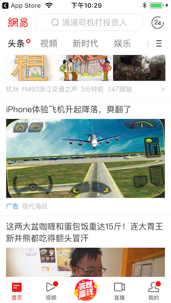

将使用到以下工具，如果没有安装请自行安装：

* usbmuxd/iproxy：通过USB进行ssh连接（brew install usbmuxd）
* [frida](https://github.com/frida/frida)/[frida-ios-dump](https://github.com/AloneMonkey/frida-ios-dump)：用于对AppStore应用砸壳
* [class-dump](https://github.com/nygard/class-dump)：用于导出App的头文件
* [Charles](https://www.charlesproxy.com/)：用于对App接口抓包
* [Reveal](https://revealapp.com/)：查看App层级结构
* [MonkeyDev](https://github.com/AloneMonkey/MonkeyDev)：基于Xcode模板的开发环境，用于Hook目标App

本次逆向分析过程：

前期准备（砸壳、class-dump）-> 抓包分析 -> UI分析 -> 确定目标方法 -> Hook

逆向环境：

|          |   版本号   |
| :------: | :--------: |
|   系统   | iOS 11.0.3 |
| 网易新闻 |    35.1    |

最终Hook代码：[lanvsblue/NewsHooker](https://github.com/lanvsblue/NewsHooker)

由于IPA文件比较大，所以在这里不上传IPA文件，请自行砸壳或从各大助手下载。

## 砸壳

苹果会对所有上架AppStore的应用加一层壳，只有砸壳后的应用才能进行后面的class-dump、注入dylib、Hook，所以砸壳是所有逆向分析的第一步。但是砸壳这一步需要使用到越狱设备，如果有条件的同学建议尝试体验一下这个过程，没有条件的同学可以直接到各大助手平台下载已砸壳的应用（越狱应用）。

首先使用iproxy映射22端口到2222端口上，ssh时通过本地2222端口连接设备。一方面不依赖WIFI可以加快SSH的连接速度；一方面frida-ios-dump依赖于2222端口进行砸壳。
```bash
iproxy 2222 22
```

ssh连接越狱设备：

```bash
ssh root@127.0.0.1 -p2222
```

ssh到越狱设备后，输入以下命令，运行frida-server：

```bash
frida-server
```

在Mac端的控制台输入以下命令，检查frida通信是否正常：

```bash
frida-ps -U
```

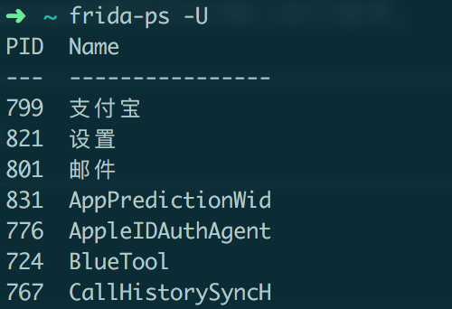

frida-ps命令会将所有进程的PID和name列出，接着切换到frida-ios-dump目录下，执行dump.py就可以砸壳了：

```bash
cd frida-ios-dump
python dump.py 网易新闻		#python dump.py com.netease.news
```
在frida-ios-dump目录下，就可以找到砸壳后的IPA文件了

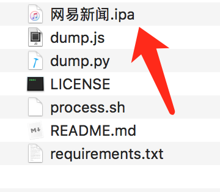

## class-dump

Class-dump通过Objective-C的runtime，可以导出目标App的@interface和@protocol。导出的头文件用于后面锁定目标方法。虽然MonkeyDev中带有class-dump工具，只要修改参数就能够自动dump，但是这个过程建议自己体验一遍。

将`网易新闻.ipa`重命名为`网易新闻.zip`并且解压，进入解压出的`Payload`文件夹中，会发现一个包。鼠标右键，点击显示包内容：


找到名为`NewsBoard`的二进制文件，就可以class-dump了：

```bash
class-dump NewsBoard -H -o ~/Desktop/NewsHooker/NewsBoard-dump-Header
```

这里解释一下参数：

* -H：输出头文件在当前或目标目录下
* -o：指定输出目录

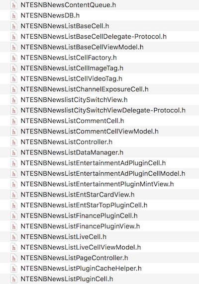

可以先大致观赏一下头文件，看看网易新闻的架构。当然要是心里有很多疑问，也很正常，现在不用纠结这些疑问。

## 接口抓包

#### 设置iOS SSL代理

首先打开Charles，点击Help-SSL Proxying-Install Charles on a Mobile Device or Remote Browser：

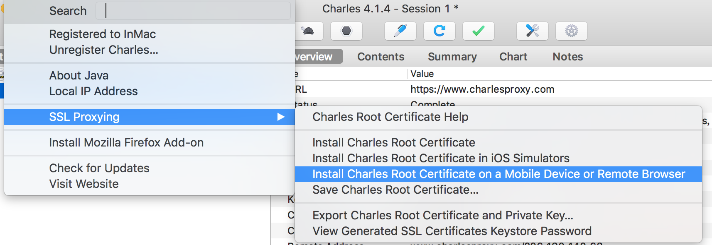

在设备中输入代理服务器地址：


在Safari中输入`chls.pro/ssl`安装描述文件，并且在设置-通用-关于本机-证书信任设置中信任证书。

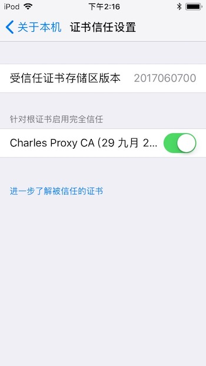

#### 对下拉刷新抓包

我们需要对服务器返回新闻和广告的数据结构有一个了解，网易新闻请求数据有两种方式：

* 打开应用时请求新闻
* 下拉刷新时请求新闻

由于打开应用的时候App会对服务器请求较多数据，比较容易干扰视线，所以选择第二种时机进行抓包。打开网易新闻，这时候可以看见Charles确实显示有大量接口被请求：


但是会发现我们并查看不了Https的请求内容和返回内容，因为我们需要配置一下SSL代理的白名单。点击Charles顶部工具栏Proxy-SSL Proxying Settings，在设置界面增加两条记录:


```
*.126.net:443
*.163.com:443
```
接着点击顶部的清除按钮清除请求记录，然后我们下拉刷新首页数据，在`https://nex.163.com/q`URL中找到了我们要的答案：


非常明显，这个就是请求广告的接口了。既然找到这儿了就看看为了拉取广告，网易新闻上传了哪些信息，下面的数据已经经过筛选了：
```json
{
	"adunit": {
		"app_version": "34.0",
		"city": "",
		"location": "1,2,20,21,22,23,24,25,26,27,28,29,30,31,10",
		"province": ""
	},
	"device": {
		"dt": "iPod7,1",	#设备型号
		"idfa": "54E66219-1792-42F9-8CFB-61125B684C5D",		#广告标识
		"mcc": "",	#位置标识
		"longitude": "",
		"latitude": "",
		"dq": "640x1136",	#分辨率
		"os": "ios",
		"imei": "",		#设备识别码
		"city_code": "",
		"network_status": "wifi",
		"udid": ""
	},
}
```

再看看`https://c.m.163.com/recommend/getSubDocPic`接口返回的数据：

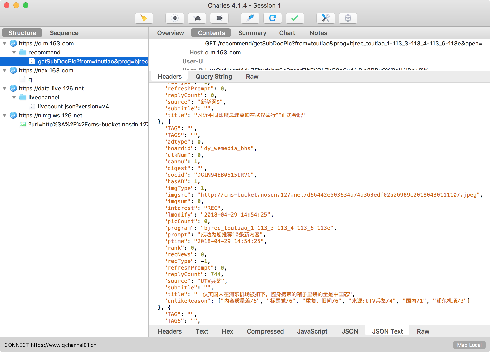
这个接口就是非常正经的返回新闻的接口了。

通过分析请求接口可以发现，网易新闻一次下拉刷新会请求两个接口一个广告接口一个新闻接口。请求结束后，将两组数据组装在Cell中。只要不是一个接口返回新闻+广告的，就好办了。这里接有一个很明显的Hook点，只要准确得Hook住存放广告数据模型的Array，让它永远返回一个空数据就完事了，当然这只是一个猜测。

## 使用Reveal分析App界面

#### MonkeyDev
MonkeyDev基于Xcode的模板集成了各种逆向开发工具(class-dump、RevealServer、cyscript、动态库的注入与签名、app的重签名、CaptainHook Tweak、Logos Tweak等)大大简化了非越狱逆向开发的流程。
创建MonkeyApp，项目名这里写`NewsHooker`：

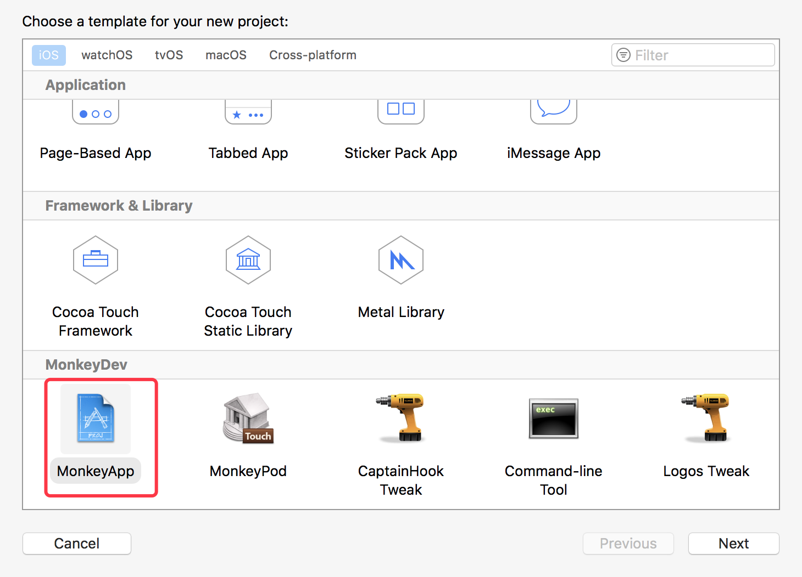

将砸壳完的应用放在TargetApp目录下：


因为MonkeyDev集成的RevealServer版本可能与自己的RevealServer版本不一致，所以需要使用Reveal.app中的RevealServer替换MonkeyDev中的RevealServer。打开Reveal.app中的RevealServer位置：


替换/opt/MonkeyDev/Frameworks中的RevealServer。

配置好App证书以后就可以run到真机上了：


#### 确定目标Controller

打开Reveal，可以一窥网易新闻的层级结构：

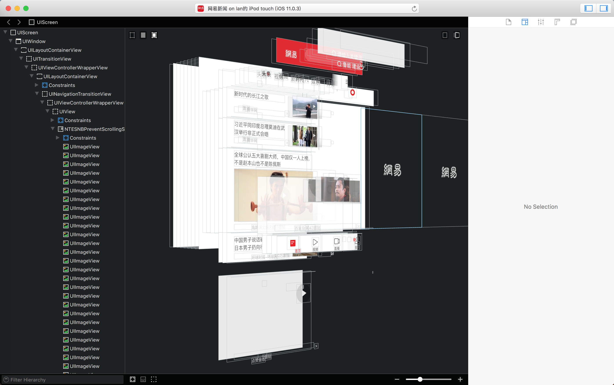

大部分的iOS开发都会采用MVC的设计模式开发App，所以这就意味着请求网络数据和存储数据模型arry发生在Controller中。我们需要找出新闻列表页面是哪一个Controller，当然如果有一个父类的Controller负责请求数据、存储数据模型array那么久只要怼这一个Controller就可以让这个世界清静了。

在Reveal中选中一个view在右侧可以看到它所在的Controller：

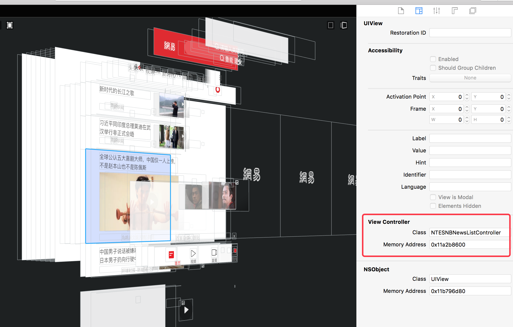

通过尝试，和查看class-dump出来的header得出以下结论

|                              |            Controller             |         Super Controller         |
| :--------------------------: | :-------------------------------: | :------------------------------: |
| 头条、科技、娱乐等大部分模块 |     NTESNBNewsListController      |  NTESNBRecommendBasicController  |
|             视频             |   NTESNBVideoNewsListController   |     NTESNBNewsListController     |
|             要闻             | NTESNBImportantNewsListController |     NTESNBNewsListController     |
|             本地             |   NTESNBLocalNewsListController   |     NTESNBNewsListController     |
|             热点             |    NTESNBHotNewsListController    |     NTESNBNewsListController     |
|                              |   NTESNBHouseNewsListController   |     NTESNBNewsListController     |
|                              |  NTESNBReaderNewsListController   |     NTESNBNewsListController     |
|                              |  NTESNBBannerNewsListController   |     NTESNBNewsListController     |
|                              |   NTESNBAutoNewsListController    |     NTESNBNewsListController     |
|            直播类            |                 *                 | NTESNBLiveNewsListBaseController |

看到这里，开心的我眼泪流下来。当然希望在NTESNBNewsListController中能找到我们要的答案。

## 分析dump出的目标Controller header文件

在之前我猜测，在Controller中会有模型Array来存储服务器返回的广告数据，通过对关键词的筛选，找到了以下与广告相关的属性：

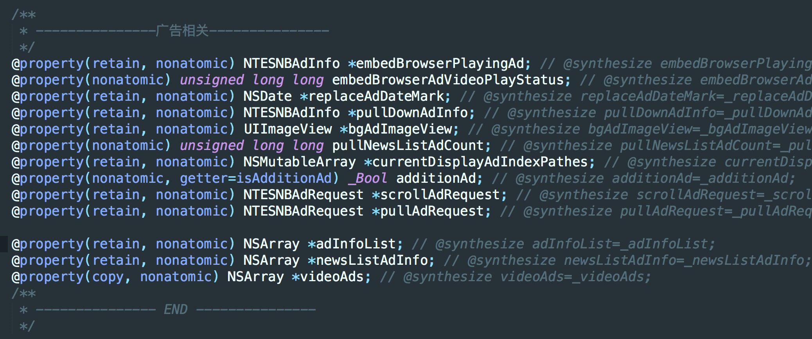

注意最后三条属性，这就是我们要找的模型array了，我的猜测没有错！通过查找setArray方法调用的位置，就可以顺藤摸瓜找到接收服务器返回广告的回调了（如果使用_array的方法赋值的话，只能寻找别的办法了）。

当然既然找到这里就让我们看看与广告相关的方法吧：

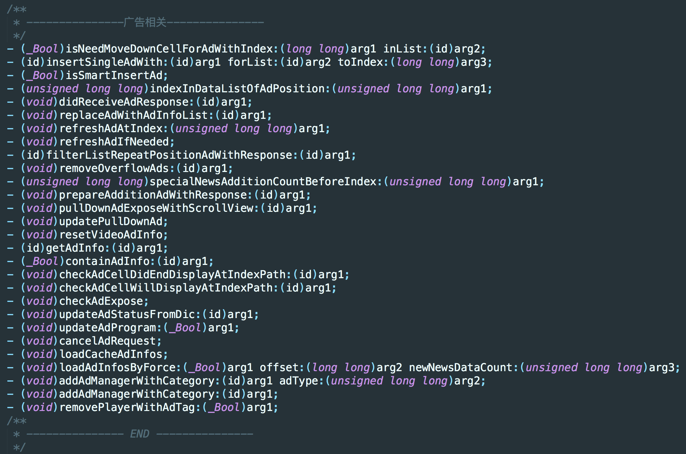

## Hook

#### 打印目标Controller的方法调用过程

想要知道Controller在下拉刷新时具体干了哪些事情，我们可以用MonkeyDev中的ANYMethodLog追踪Controller的方法调用。这里不使用MDMethodTrace追踪Controller的方法的原因是，MDMethodTrace不能设置黑名单，接下来我们会用到黑名单来屏蔽滚动时Controller触发的方法。

在NewsHookerDylib目录下创建NewsHooker类：

```objective_c
#import <Foundation/Foundation.h>

@interface NewsHooker : NSObject

+ (instancetype)sharedInstance;

- (void)logMethod;
@end
```

```objective_c
#import "NewsHooker.h"
#import "ANYMethodLog.h"
#import "MDMethodTrace.h"

@interface NewsHooker()

@end

@implementation NewsHooker

+ (instancetype)sharedInstance {
    static NewsHooker *instance;
    if (!instance) {
        instance = [[NewsHooker alloc] init];
    }
    return instance;
}

- (void)logMethod {
    [ANYMethodLog logMethodWithClass:NSClassFromString(@"NTESNBNewsListController")
                           condition:^BOOL(SEL sel) {
                               // hook 所有方法
                               return YES;

                           } before:^(id target, SEL sel, NSArray *args, int deep) {
                               // 方法调用前
                               NSLog(@"-----BF<%d>----- sel:%@ args:%@", deep, NSStringFromSelector(sel),args);
                           } after:^(id target, SEL sel, NSArray *args, NSTimeInterval interval, int deep, id retValue) {
                               // 方法调用后
                               NSLog(@"-----AF<%d>----- sel:%@ args:%@ retValue:%@", deep, NSStringFromSelector(sel),args, retValue);
                           }];
    
}

@end
```

然后修改NewsHookerDylib.m：

```objective_c
CHConstructor{
        [[NewsHooker sharedInstance] logMethod];
}
```

点击运行，MonkeyDev会自动对dylib重签名、将dylib注入到App中、对App重签名。由于打印的信息在Xcode的控制台显示不全（未知原因），但是可以打开系统的控制台应用，查看打印日志：

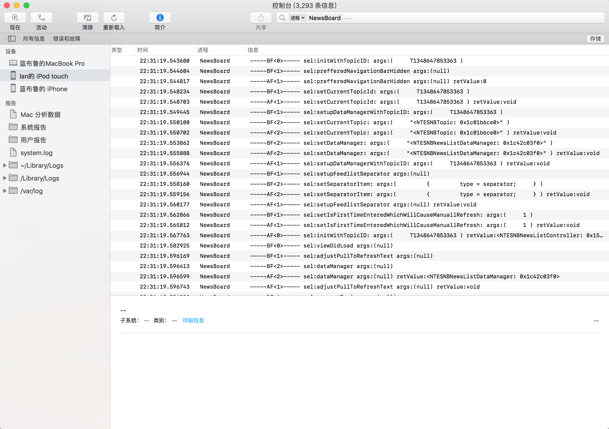

#### 确定目标方法

还是和之前一样，我们想知道在下拉刷新请求数据时，Controller做了哪些操作，接着清空控制台中的记录，下拉刷新网易新闻。我们发现，打印出的调用信息中充斥着大量的与滑动相关的方法，而这些方法和我们的目标没有关系，所以我们要使用黑名单将这些代码忽略掉，经过筛选，将滚动时调用的方法放入黑名单数组中：

```objective_c
@interface NewsHooker()

@property (nonatomic, strong) NSSet *blackList;

@end
    
@implementation NewsHooker

......

- (void)logMethod {
    [ANYMethodLog logMethodWithClass:NSClassFromString(@"NTESNBNewsListController")
                           condition:^BOOL(SEL sel) {
                               NSString *selString = NSStringFromSelector(sel);

                               for (NSString *blackString in self.blackList) {
                                   if([selString isEqualToString:blackString]) {
                                       return NO;
                                   }
                               }

                               return YES;

                           } before:^(id target, SEL sel, NSArray *args, int deep) {
                               ......
                           } after:^(id target, SEL sel, NSArray *args, NSTimeInterval interval, int deep, id retValue) {
                               ......
                           }];
    
}

-(NSSet *)blackList {
    if (!_blackList) {
        NSArray *array = @[@"removePlayer", @"removePlayerWithAdTag:",
                           @"resetCurrentPlayVideoInfo", @"setCurrentPlayVideoModel:",
                           @"setCurrentPlayVideoOriginData:", @"setCurrentPlayVideoCell:",
                           @"setVideoPlayer:", @"videoPlayer",
                           @"setEmbedBrowserAdVideoPlayStatus:", @"canPlayVideoWithModel:atIndexPath:",
                           @"videoIdWithModel:", @"viewModelAtIndexPath:",
                           @"articleRecordArr", @"scrollViewDidEndDecelerating:",
                           @"changeRocketToTranslucent:", @"needRefreshABTest",
                           @"checkNeedPlayVideo", @"newsListContentScrollPrefetchSinceOffset:",
                           @"scrollViewDidScroll:", @"checkNeedRemovePlayer",
                           @"currentPlayVideoOriginData", @"currentDisplayAdIndexPathes",
                           @"pullDownAdExposeWithScrollView:", @"bgAdImageView",
                           @"checkAdExpose", @"scrollViewWillBeginDragging:",
                           @"pullDownAdInfo", @"scrollViewDidEndDragging:willDecelerate:"];
        _blackList = [NSSet setWithArray:array];
    }
    return _blackList;
}
@end
```

运行代码，清空控制台后下拉刷新，就没有烦人的滚动方法了。

在控制台中查找模型array的set方法（setNewsListAdInfo/setAdInfoList/setVideoAds），很遗憾并没有找到setVideoAds方法的调用，但是搜索setNewsListAdInfo和setAdInfoList时，发现在一片区域内大量输出：

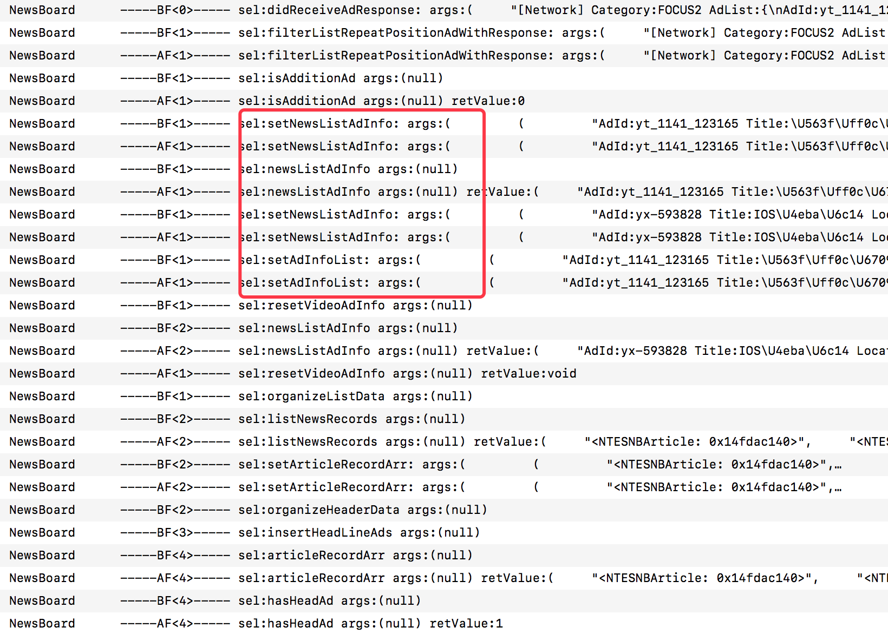

通过分析日志，很容易发现，这一切的起源来自于`didReceiveAdResponse:`方法的调用。从名字上看，这是一个回调方法，参数就是返回的广告数据。我们要做的就是直接将这个方法return，就不会把请求返回的数据加入到模型array中并显示了。

#### Hook目标方法

CaptainHook是一个基于宏定义的Hook工具，使用起来十分简单，以下是官方的使用描述：

> Objective-C runtime hooking using CaptainHook:
> 1. declare class using CHDeclareClass()
> 2. load class using CHLoadClass() or CHLoadLateClass() in CHConstructor
> 3. hook method using CHOptimizedMethod()
> 4. register hook using CHHook() in CHConstructor
> 5. (optionally) call old method using CHSuper()

用中文解释就是：

1. 使用CHDeclareClass()申明类
2. 在初始化方法CHConstructor中，使用CHLoadClass() or CHLoadLateClass()加载类
3. 使用CHOptimizedMethod() Hook方法
4. 在初始化方法CHConstructor中，使用CHHook() 注册Hook的方法
5. 可以使用CHSuper()调用原方法(可选)

我们遵循上面的步骤，对-[NTESNBNewsListController didReceiveAdResponse:]类进行Hook。

首先在NewsHookerDylib.h文件中申明我们需要Hook的类（可选，不申明会有警告信息而已）：

```objective_c
#import <Foundation/Foundation.h>

@interface NTESNBNewsListController

- (void)didReceiveAdResponse:(id)arg1;

@end
```

然后修改NewsHookerDylib.m:

```objective_c
#import "NewsHookerDylib.h"
#import <CaptainHook/CaptainHook.h>
#import <UIKit/UIKit.h>
#import "NewsHooker.h"

CHDeclareClass(NTESNBNewsListController)

#pragma clang diagnostic push
#pragma clang diagnostic ignored "-Wstrict-prototypes"


CHOptimizedMethod1(self, void, NTESNBNewsListController, didReceiveAdResponse, id , arg1) {
    return;
}

CHConstructor{
    CHLoadLateClass(NTESNBNewsListController);
    CHHook1(NTESNBNewsListController, didReceiveAdResponse);
    
//    [[NewsHooker sharedInstance] logMethod];
}
```

至此，大功告成。运行后，就看不见新闻列表的广告了！